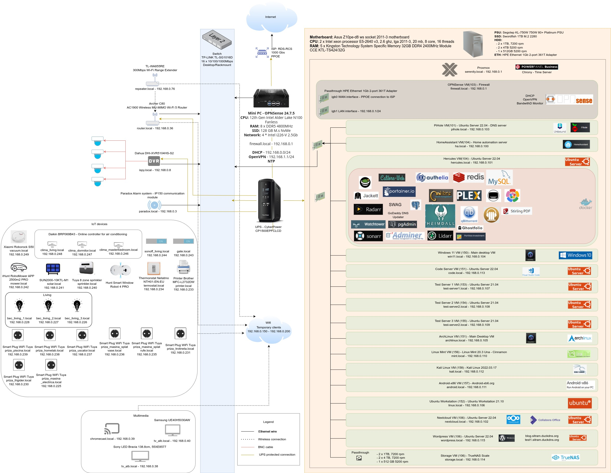

# About my Homelab

This repository is intended to record my experience in setting up a HomeLab using a dedicated server running [Proxmox](https://www.proxmox.com/en/) with various services running in multiple VM's and other IoT equipment. I will be touching topics related to virtualization, hardware passtrough, Docker, NAS, firewall, DNS printers, home automation and many others. This document is a work in progress and will evolve as I gain more experience and find more interesting stuff to experiment with.

Over time, the HomeLab grew by adding IoT devices, Wifi range extender, climate control, UPS, printer and other equipment. Most of the hardware is housed in a rack, mounted on a wall under the staircase in my house. The rack is located in a separate room which I use as a closet. This helps a lot to reduce the discomfort caused by noise and heat. At least once a year, I unplug the equipment and clean it uing compressed air.

I plan to upgrade the main server with additional storage, a dedicated GPU and extend the HomeLab capabilities with additional equipment that adds value. I am always open for suggestions so feel free to reach me over email in case you have one.

The software, services and the overall architecture of my my HomeLab are constantly adapting and evolving when I find some kind of software or an equipment which adds value to my HomeLab.

The purpose of this repository is not to be a tutorial on how to set up a HomeLab. I record configurations and installation instructions in case something wrong happens.

Use the information provided in this repository at your own risk. I take no responsibility for any damage to your equipment. Depending on my availability I can support with software issues. but be prepared to troubleshoot on your own because this is the best way to learn. My recommendation is to take the information that I provide here and adapt it to your own needs and hardware.

I think overall it was a good decision to start my own HomeLab even if the journey is not an easy one. I gained a lot of experience and I added a lot of functionalities which bring value. I learned the importance of having a robust system and the effort it takes to maintain it. I learned the important of documentation and this is the reason why I put so much effort into setting up this repository. Besides having cool functionalities, I  maintaining a HomeLab builds a set of skills which are valuble in other aspects of my life.

My only regret is that I couldn't convince any of my friends or family to become interested in this stuff. Everyone I talked with thinks what I do is cool, but they don't want to get into it. Because of this it's been a rather lonley journey.

The most important thing I learned along the way, was that no matter how awesome my HomeLab is, if the Internet is my house is down because of my stuff, I'm screwed! :)

For any questions please contact me at **adrian.martis (at) gmail . com**

## How I started

Initially I started my adventure in building an HomeLab on an old laptop, where I installed Proxmox and did some testing with several VM's and [HomeAssistant](https://www.home-assistant.io/).

It probably would have been enough if it didn't had two annoying issues. Every couple of days, the laptop froze and I had to manually reboot it. The second issue was that BIOS did not support resuming to the last power state in case of a power shortage. I couldn't run the laptop for more then a few days without having to physically interact with it which meant I couldn't have a reliable server for running services or home automation.

After struggling with this setup for a couple of months I decided it was time for an upgrade.

I spent several weeks researching online about best practices in hardware builds for an HomeLab. I read blogs, joined several channels on Reddit and groups on Facebook dedicated to this topic. The more I spent researching, the more I got frustrated of how easy it was for people living in US, Germany or UK to access all kind of second hand server-grade equipment. I either had to make a compromise and buy consumer grade equipment, spent extra money on shipping tax to order it outise of my own country, or get lucky and find a good deal in my own country.

In the end, it payed off to be patient, because I got lucky and found a complete system for sale locally. Everyone I talked with, said it was overkill for what I wanted to run in my HomeLab. I diregarded their advices and went with my gut feeling. I payed for the entire PC around 800$ and now I had the equipment needed to fulfill any project I wanted.

My future server was a beast:

- Motherboard: ASUS Z10pe-d8
- CPU: 2x Intel Xeon E5-2640 v3, 2.6Ghz, 8 cores, 16 threads
- RAM: 192 GB Kingston DDR4 2400MHz with ECC
- PSU: 750W Segotep 80+ Platinum
- Black case

I added 3 spare HDD's from old laptops I had laying arround because the PC was sold without any storage. Two of them were configured with ZFS mirror RAID to have some kind of redundancy for some of my critical data, in case one of them failed. The third one I used to store less important data, like tv shows and movies.I bought a 1TB M.2 2280 consumer SSD from SWORDFISH to use for host operating system. The final purchase was an 1 GB Ethernet PCIe card which was asstrough to a VM running a dedicated firewall.With above equipment, I decided it was enough to start my journey into the wonderfull world of building and maintaining a HomeLab.

## Document structure

The document is written in Markdown and structured in 3 main sections.

First section contains a short history, current HomeLab state and structure of the document.

The second section contains general tutorials that are independed to any any VM. Some of the commands assume that either the DHCP or the DNS server is up and running, so please keep this in mind when reading.

The third section contains a chapter for every server, bare-bone or virtualized I run. Inside each chapter there are sections that describe:

- Proxmox VM configuration or HW used
- OS configuration
- Installation and configuration of the specific software that runs on that server.

This is a work in progress so expect that some of these chapters are empty and will be added at a later date based on my availability.

## Table of contents

- [General](./general/general.md#general)
  - [SSH configuration](./general/general.md#ssh-configuration)
  - [Execute commands using SSH](./general/general.md#execute-commands-using-ssh)
  - [How to fix warning about ECDSA host key](./general/general.md#how-to-fix-warning-about-ecdsa-host-key)
  - [Ubuntu - Initial setup of an clonned VM](./general/general.md#ubuntu---initial-setup-of-an-clonned-vm)
  - [Ubuntu - upgrade from older distribution](./general/general.md#ubuntu---upgrade-from-older-distribution)
  - [Ubuntu - configure unattended upgrades](./general/general.md#ubuntu---configure-unattended-upgrades)
  - [Ubuntu - Clean unnecessary packages](./general/general.md#ubuntu---clean-unnecessary-packages)
  - [Ubuntu - Remove old kernels on Ubuntu](./general/general.md#ubuntu---remove-old-kernels)
  - [Ubuntu - Clean up snap on Ubuntu](./general/general.md#ubuntu---clean-up-snap)
  - [Clear systemd journald logs](./general/general.md#clear-systemd-journald-logs)
  - [Ubuntu - MariaDB update](./general/general.md#ubuntu---mariadb-update)
  - [Ubuntu - Install nginx](./general/general.md#ubuntu---install-nginx)
  - [Ubuntu - Configure PHP source list](./general/general.md#ubuntu---configure-php-source-list)
  - [Ubuntu - Replace netplan.io with systemd-networkd](./general/general.md#ubuntu---replace-netplanio-with-systemd-networkd)
  - [Ubuntu - Synchronize time with systemd-timesyncd](./general/general.md#ubuntu---synchronize-time-with-systemd-timesyncd)
  - [Ubuntu - Synchronize time with ntpd](./general/general.md#ubuntu---synchronize-time-with-ntpd)
  - [Ubuntu - Synchronize time with chrony](./general/general.md#ubuntu---synchronize-time-with-chrony)
  - [Update system timezone](./general/general.md#update-system-timezone)
  - [Correct DNS resolution](./general/general.md#correct-dns-resolution)
  - [Qemu-guest-agent](./general/general.md#qemu-guest-agent)
  - [Simulate server load](./general/general.md#simulate-server-load)
    - [CPU](./general/general.md#cpu)
    - [RAM](./general/general.md#ram)
    - [Disk](./general/general.md#disk)
  - [Generate Gmail App Password](./general/general.md#generate-gmail-app-password)
  - [Configure Postfix Server to send email through Gmail](./general/general.md#configure-postfix-server-to-send-email-through-gmail)
  - [Mail notifications for SSH dial-in](./general/general.md#mail-notifications-for-ssh-dial-in)
  - [Backup folder](./general/general.md#backup-folder)
  - [Generate random passwords or tokens](./general/general.md#generate-random-passwords-or-tokens)
  - [Install John the Ripper](./general/general.md#install-john-the-ripper)
  - [Mysql - recover lost user password](./general/general.md#mysql---recover-lost-user-password)
  - [Find all files containing a specific text (string) on Linux](./general/general.md#find-all-files-containing-a-specific-text-string-on-linux)
  - [Indication of disk failures](./general/general.md#indication-of-disk-failures)
  - [Methods ot execute commands in parallel](./general/general.md#methods-ot-execute-commands-in-parallel)
  - [Count files and folders reqursively trough directories](./general/general.md#count-files-and-folders-reqursively-trough-directories)
- [Proxmox - Virtualization server](./proxmox/proxmox.md#proxmox---virtualization-server)
  - [Proxmox - OS configuration](./proxmox/proxmox.md#proxmox---os-configuration)
  - [Proxmox - NTP time server](./proxmox/proxmox.md#proxmox---ntp-time-server)
  - [Proxmox - PCI Passthrough configuration](./proxmox/proxmox.md#proxmox---pci-passthrough-configuration)
  - [Proxmox - UPS monitoring software](./proxmox/proxmox.md#proxmox---ups-monitoring-software)
  - [Proxmox - VNC client access configuration](./proxmox/proxmox.md#proxmox---vnc-client-access-configuration)
- [pfSense - Firewall, DHCP and NTP server](./proxmox/proxmox.md#pfsense---firewall-dhcp-and-ntp-server)
  - [pfSense - VM configuration](./pfsense/pfsense.md#pfsense---vm-configuration)
  - [pfSense - Setup](./pfsense/pfsense.md#pfsense---setup)
  - [Firewall / NAT / Port Forward](./pfsense/pfsense.md#firewall--nat--port-forward)
  - [Firewall / NAT / Outbound](./pfsense/pfsense.md#firewall--nat--outbound)
  - [pfSense - DHCP server setup](./pfsense/pfsense.md#pfsense---dhcp-server-setup)
  - [pfSense - OpenVPN setup](./pfsense/pfsense.md#pfsense---openvpn-setup)
- [piHole - All-around DNS solution server](./pihole/pihole.md#pihole---all-around-dns-solution-server)
  - [piHole - VM configuration](./pihole/pihole.md#pihole---vm-configuration)
  - [piHole - OS Configuration](./pihole/pihole.md#pihole---os-configuration)
  - [piHole - Setup](./pihole/pihole.md#pihole---setup)
  - [piHole - Ubound as a recursive DNS server](./pihole/pihole.md#pihole---ubound-as-a-recursive-dns-server)
  - [piHole - Local DNS configuration](./pihole/pihole.md#pihole---local-dns-configuration)
- [TrueNAS - Storage management server](./truenas/truenas.md#truenas---storage-management-server)
  - [TrueNAS - VM configuration](./truenas/truenas.md#truenas---vm-configuration)
  - [TrueNAS - HDD passtrough](./truenas/truenas.md#truenas---hdd-passtrough)
  - [TrueNAS - OS Configuration](./truenas/truenas.md#truenas---os-configuration)
  - [TrueNAS - Setup](./truenas/truenas.md#truenas---setup)
  - [System Settings -> General](./truenas/truenas.md#system-settings---general)
  - [System Settings -> Services](./truenas/truenas.md#system-settings---services)
  - [System Settings -> Advanced](./truenas/truenas.md#system-settings---advanced)
  - [Credentials -> Local Users](./truenas/truenas.md#credentials---local-users)
  - [Credentials -> Local Groups](./truenas/truenas.md#credentials---local-groups)
  - [Network](./truenas/truenas.md#network)
  - [Shares](./truenas/truenas.md#shares)
- [HomeAssistant - Home automation server](./homeassistant/homeassistant.md#homeassistant---home-automation-server)
  - [HomeAssistant - VM configuration](./homeassistant/homeassistant.md#homeassistant---vm-configuration)
  - [HomeAssistant - Installation and setup](./homeassistant/homeassistant.md#homeassistant---installation-and-setup)
  - [HomeAssistant - Other plugins](./homeassistant/homeassistant.md#homeassistant---other-plugins)
  - [HomeAssistant - Mosquitto broker(MQTT)](./homeassistant/homeassistant.md#homeassistant---mosquitto-brokermqtt)
  - [HomeAssistant - Paradox Alarm integration](./homeassistant/homeassistant.md#homeassistant---paradox-alarm-integration)
  - [HomeAssistant - UPS integration](./homeassistant/homeassistant.md#homeassistant---ups-integration)
  - [HomeAssistant - Integration of CCTV cameras](./homeassistant/homeassistant.md#homeassistant---integration-of-cctv-cameras)
  - [HomeAssistant - Google Assistant integration](./homeassistant/homeassistant.md#homeassistant---google-assistant-integration)
  - [HomeAssistant - Recorder integration](./homeassistant/homeassistant.md#homeassistant---recorder-integration)
- [Nextcloud - Content collaboration server](./nextcloud/nextcloud.md#nextcloud---content-collaboration-server)
  - [Nextcloud - VM configuration](./nextcloud/nextcloud.md#nextcloud---vm-configuration)
  - [Nextcloud - OS Configuration](./nextcloud/nextcloud.md#nextcloud---os-configuration)
  - [Nextcloud - Installation and configuration of nginx web server](./nextcloud/nextcloud.md#nextcloud---installation-and-configuration-of-nginx-web-server)
  - [Nextcloud - Installation and configuration of PHP 8.0](./nextcloud/nextcloud.md#nextcloud---installation-and-configuration-of-php-80)
  - [Nextcloud - Installation and configuration of MariaDB database](./nextcloud/nextcloud.md#nextcloud---installation-and-configuration-of-mariadb-database)
  - [Nextcloud - Database creation](./nextcloud/nextcloud.md#nextcloud---database-creation)
  - [Nextcloud - Installation of Redis server](./nextcloud/nextcloud.md#nextcloud---installation-of-redis-server)
  - [Nextcloud - Optimize and update using a script](./nextcloud/nextcloud.md#nextcloud---optimize-and-update-using-a-script)
  - [Nextcloud - Bash aliases for executing Nextcloud Toolset occ](./nextcloud/nextcloud.md#nextcloud---bash-aliases-for-executing-nextcloud-toolset-occ)
  - [Nextcloud - Map user data directory to nfs share](./nextcloud/nextcloud.md#nextcloud---map-user-data-directory-to-nfs-share)
- [Hercules - HomeLab services VM](./hercules/hercules.md./hercules/hercules.md#hercules---homelab-services-vm)
  - [Hercules - VM configuration](./hercules/hercules.md#hercules---vm-configuration)
  - [Hercules - OS Configuration](./hercules/hercules.md#hercules---os-configuration)
  - [Hercules - Move docker container configuration folder to NAS](./hercules/hercules.md#hercules---move-docker-container-configuration-folder-to-nas)
  - [Hercules - Docker installation and docker-compose](./hercules/hercules.md#hercules---docker-installation-and-docker-compose)
    - [Hercules - Remove docker packages from Ubuntu repository](./hercules/hercules.md#hercules---remove-docker-packages-from-ubuntu-repository)
    - [Hercules - set up Docker repository](./hercules/hercules.md#hercules---set-up-docker-repository)
    - [Hercules - Install Docker Engine](./hercules/hercules.md#hercules---install-docker-engine)
  - [Hercules - Watchtower docker container](./hercules/hercules.md#hercules---watchtower-docker-container)
  - [Hercules - Heimdall docker container](./hercules/hercules.md#hercules---heimdall-docker-container)
  - [Hercules - Portainer docker container](./hercules/hercules.md#hercules---portainer-docker-container)
  - [Hercules - Calibre docker container](./hercules/hercules.md#hercules---calibre-docker-container)
  - [Hercules - Calibre-web docker container](./hercules/hercules.md#hercules---calibre-web-docker-container)
  - [Hercules - qBitTorrent docker container](./hercules/hercules.md#hercules---qbittorrent-docker-container)
  - [Hercules - Jackett docker container](./hercules/hercules.md#hercules---jackett-docker-container)
  - [Hercules - Sonarr docker container](./hercules/hercules.md#hercules---sonarr-docker-container)
  - [Hercules - Radarr docker container](./hercules/hercules.md#hercules---radarr-docker-container)
  - [Hercules - Bazarr docker container](./hercules/hercules.md#hercules---bazarr-docker-container)
  - [Hercules - Lidarr docker container](./hercules/hercules.md#hercules---lidarr-docker-container)
  - [Hercules - Overseerr docker container](./hercules/hercules.md#hercules---overseerr-docker-container)
  - [Hercules - GoDaddy DNS Updater](./hercules/hercules.md#hercules---godaddy-dns-updater)
  - [Hercules - SWAG - Secure Web Application Gateway docker container](./hercules/hercules.md#hercules---swag---secure-web-application-gateway-docker-container)
  - [Hercules - Plex docker container](./hercules/hercules.md#hercules---plex-docker-container)
  - [Hercules - PostgressSQL database docker container](./hercules/hercules.md#hercules---postgresssql-database-docker-container)
  - [Hercules - MySQL database docker container](./hercules/hercules.md#hercules---mysql-database-docker-container)
  - [Hercules - Adminer docker container](./hercules/hercules.md#hercules---adminer-docker-container)
  - [Hercules - PGAdmin docker container](./hercules/hercules.md#hercules---pgadmin-docker-container)
  - [Hercules - Guacamole daemon and web application docker container](./hercules/hercules.md#hercules---guacamole-daemon-and-web-application-docker-container)
  - [Hercules - Redis docker container](./hercules/hercules.md#hercules---redis-docker-container)
  - [Hercules - LibreSpeed docker container](./hercules/hercules.md#hercules---librespeed-docker-container)
  - [Hercules - Authelia docker container](./hercules/hercules.md#hercules---authelia-docker-container)
  - [Hercules - PortfolioPerformance docker container](./hercules/hercules.md#hercules---portfolioperformance-docker-container)
- [Windows11 - Virtual Windows Desktop VM](./hercules/hercules.md./hercules/hercules.md#windows11---virtual-windows-desktop-vm)
  - [Windows11 - VM configuration](./windows/windows.md#windows11---vm-configuration)
  - [Windows11 - Windows installation](./windows/windows.md#windows11---windows-installation)
  - [Windows11 - Remote Desktop Connection configuration](./windows/windows.md#windows11---remote-desktop-connection-configuration)
- [Code - coding VM](./code/code.md#code---coding-vm)
  - [Code - VM configuration](./code/code.md#code---vm-configuration)
  - [Code - OS Configuration](./code/code.md#code---os-configuration)
  - [Code - CodeServer installation and configuration](./code/code.md#code---codeserver-installation-and-configuration)
  - [Code - Accessing CodeServer from outside local network](./code/code.md#code---accessing-codeserver-from-outside-local-network)
- [ArchLinux - Desktop VM](./archlinux/archlinux.md#archlinux---desktop-vm)
  - [ArchLinux - VM configuration](./archlinux/archlinux.md#archlinux---vm-configuration)
  - [ArchLinux - OS Configuration](./archlinux/archlinux.md#archlinux---os-configuration)
    - [Configure wireless network access](./archlinux/archlinux.md#configure-wireless-network-access)
    - [Base software installation](./archlinux/archlinux.md#base-software-installation)
    - [Configure local network mounts](./archlinux/archlinux.md#configure-local-network-mounts)
    - [Install AUT Helper](./archlinux/archlinux.md#install-aur-helper)
    - [Desktop environment installation(Cinnamon)](./archlinux/archlinux.md#desktop-environment-installationcinnamon)
    - [Desktop environment installation(Gnome)](./archlinux/archlinux.md#desktop-environment-installationgnome)
    - [Desktop environment installation(KDE)](./archlinux/archlinux.md#desktop-environment-installationkde)
    - [Common apps for all desktop environments](./archlinux/archlinux.md#common-apps-for-all-desktop-environments)
    - [Configure LightDM and Xorg to use NVIDIA driver](./archlinux/archlinux.md#configure-lightdm-and-xorg-to-use-nvidia-driver)
    - [Configure PipeWire multimedia framework](./archlinux/archlinux.md#configure-pipewire-multimedia-framework)
    - [Configure PulseAudio multimedia framework](./archlinux/archlinux.md#configure-pulseaudio-multimedia-framework)
    - [Common AUR packages](./archlinux/archlinux.md#common-aur-packages)
    - [Post instalation services handling](./archlinux/archlinux.md#post-instalation-services-handling)
  - [ArchLinux - Network configuration](./archlinux/archlinux.md#archlinux---network-configuration)
    - [ArchLinux - systemd-networkd](./archlinux/archlinux.md#archlinux---systemd-networkd)
    - [ArchLinux - NetworkManager](./archlinux/archlinux.md#archlinux---networkmanager)
  - [ArchLinux - Troubleshoot sound issues](./archlinux/archlinux.md#archlinux---troubleshoot-sound-issues)
  - [ArchLinux - I3 installation & Customization](./archlinux/archlinux.md#archlinux---i3-installation--customization)
  - [ArchLinux - ZSH shell](./archlinux/archlinux.md#archlinux---zsh-shell)
  - [ArchLinux - Downgrade packages](./archlinux/archlinux.md#archlinux---downgrade-packages)
    - [ArchLinux - Using pacman cache](./archlinux/archlinux.md#archlinux---using-pacman-cache)
    - [ArchLinux - Using Arch Linux Archive](./archlinux/archlinux.md#archlinux---using-arch-linux-archive)
    - [ArchLinux - Restore system to an earlier date](./archlinux/archlinux.md#archlinux---restore-system-to-an-earlier-date)
  - [ArchLinux - Connect Android To Arch Linux Via USB](./archlinux/archlinux.md#archlinux---connect-android-to-arch-linux-via-usb)
  - [ArchLinux - Rebuild AUR packages when python is upgraded](./archlinux/archlinux.md#archlinux---rebuild-aur-packages-when-python-is-upgraded)
  - [ArchLinux - Brother printer & scanner](./archlinux/archlinux.md#archlinux---brother-printer--scanner)
  - [ArchLinux - Chrome Remote Desktop](./archlinux/archlinux.md#archlinux---chrome-remote-desktop)
    - [ArchLinux - Chrome Remote Desktop - newer version issue](./archlinux/archlinux.md#archlinux---chrome-remote-desktop---newer-version-issue)
    - [ArchLinux - Chrome Remote Desktop - missing json file](./archlinux/archlinux.md#archlinux---chrome-remote-desktop---missing-json-file)
    - [ArchLinux - Chrome Remote Desktop - invalid escape sequence '\s'](./archlinux/archlinux.md#archlinux---chrome-remote-desktop---invalid-escape-sequence-s)
    - [ArchLinux - Chrome Remote Desktop - connect to an existing session](./archlinux/archlinux.md#archlinux---chrome-remote-desktop---connect-to-an-existing-session)
- [WordPress - WorPress server VM](./wordpress/wordpress.md#wordpress---worpress-server-vm)
  - [WordPress - VM configuration](./wordpress/wordpress.md#wordpress---vm-configuration)
  - [WordPress - OS Configuration](./wordpress/wordpress.md#wordpress---os-configuration)
  - [WordPress - Installation and configuration of nginx web server](./wordpress/wordpress.md#wordpress---installation-and-configuration-of-nginx-web-server)
  - [WordPress - Installation and configuration of PHP 8.0](./wordpress/wordpress.md#wordpress---installation-and-configuration-of-php-80)
  - [WordPress - Installation and configuration of MariaDB database](./wordpress/wordpress.md#wordpress---installation-and-configuration-of-mariadb-database)
  - [WordPress - Database creation](./wordpress/wordpress.md#wordpress---database-creation)
  - [Wordpress - Installation and optimization](./wordpress/wordpress.md#wordpress---installation-and-optimization)
  - [Wordpress - Installation of Redis server](./wordpress/wordpress.md#wordpress---installation-of-redis-server)
  - [Wordpress - Manual migration to another domain](./wordpress/wordpress.md#wordpress---manual-migration-to-another-domain)
